<p align="center">
  
</p>

```python
class AfrazKhan:
    role   = "Senior AI Engineer @ Wispa Digital"
    builds = ["competitor research agents", "SEO analysis pipelines",
              "brand-voice content workflows", "marketing idea generators"]
    stack  = ["LangGraph", "LangChain", "OpenAI", "pgvector", "Langfuse"]
    ships  = "AI features into production apps"
    based  = "Islamabad, PK"
```

<h3 align="center">toolbox</h3>

<p align="center">
  
</p>

<h3 align="center">commits, eaten</h3>

<p align="center">
  <picture>
    <source media="(prefers-color-scheme: dark)" srcset="https://raw.githubusercontent.com/afrazk-ai/afrazk-ai/output/pacman-contribution-graph-dark.svg" />
    <source media="(prefers-color-scheme: light)" srcset="https://raw.githubusercontent.com/afrazk-ai/afrazk-ai/output/pacman-contribution-graph.svg" />
    
  </picture>
</p>

